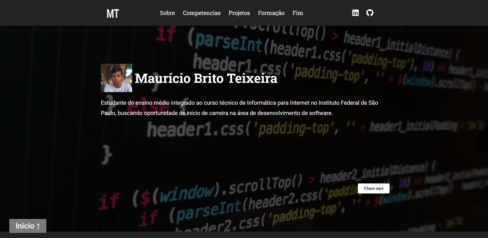
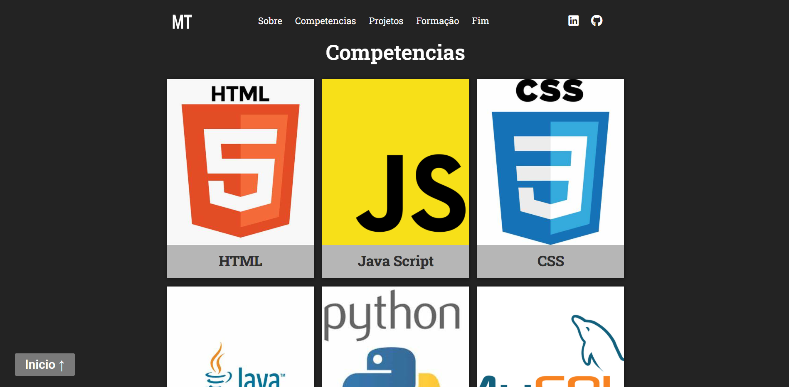
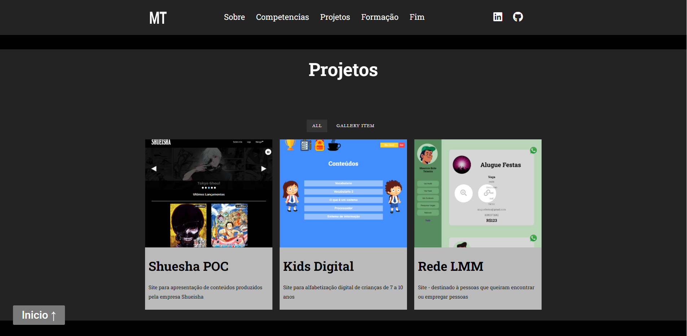
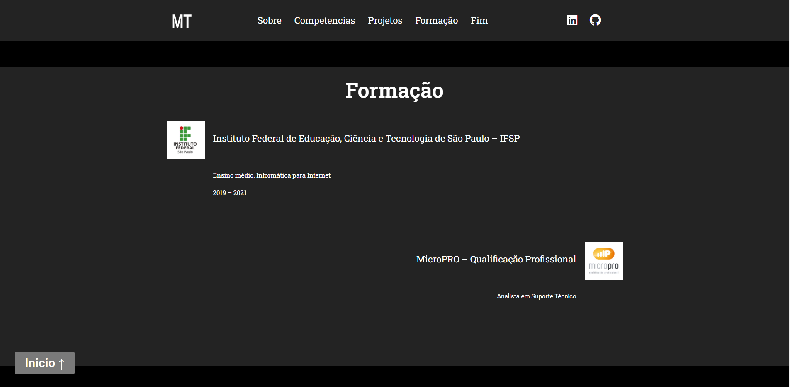
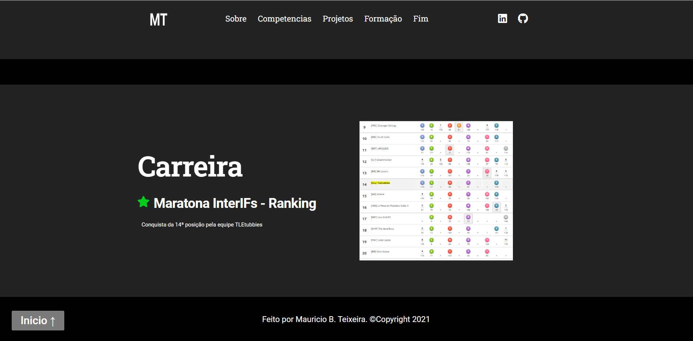

# WordPress-4 - Portifólio Kick

  
  
  
    
    
 

<h4 align="center"> 
	🚧  Portfólio ♻️ Em desenvolvimento... 🚀 🚧
</h4>

<h4 align="center"> 
  Disponivel em: <a href="http://mauricio-brito.soukick.ml/">Portfolio</a>
</h4>

 <a href="#-sobre-o-projeto">Sobre</a> •
 <a href="#-layout">Layout</a> • 
 <a href="#-como-executar-o-projeto">Como executar</a> • 
 <a href="#-tecnologias">Tecnologias</a> • 
 <a href="#-autor">Autor</a> • 
 <a href="#user-content--licença">Licença</a>

## 💻 Sobre o projeto

♻️ Portfólio desenvolvido durante a jornada Kick

Projeto desenvolvido durante **A Jornada #kick** organizado pela [#Kick](http://soukick.com.br/).

## 🎨 Layout

  

Seção - Sobre - Destinada à informações sobre mim  
  

Seção - Competencias - Destinada à mostrar minhas principais competencias  
  

Seção - Projetos - Destinada à mostrar meus principais projetos  
  
  
Seção - Formação - Destinada à mostrar minha formação ate o momento  
  
  
Seção - Carreira - Destinada à mostrar minha carreira ate o momento  
  

---

## 🚀 Como executar o projeto

### Pré-requisitos

Antes de começar, você vai precisar ter instalado em sua máquina:  
WordPress - https://br.wordpress.org/download/  
Xampp - https://www.apachefriends.org/download.html  

#### 🧭 Rodando a aplicação web (Frontend)

Este é o link para download do arquivo de exportação para ser utilizado no plugin all-in-one Wp migration:   https://drive.google.com/file/d/1NUWbtMwPxMnUVFpXurK04OfKQjuctPMH/view?usp=sharing

---

## 🛠 Tecnologias

As seguintes ferramentas foram usadas na construção do projeto:

#### **Website**  (WordPress)

---

## 🦸 Autor

---

## 📝 Licença

Este projeto esta sobe a licença [MIT](./LICENSE).

Feito por Mauricio Teixeira 👋🏽 [Entre em contato!](https://www.linkedin.com/in/mauricio-teixeira-37a932196/)

---
